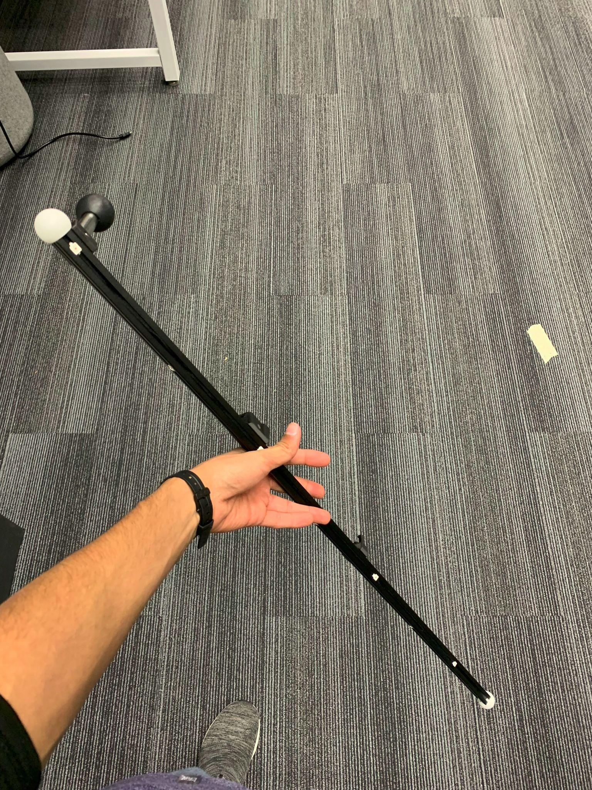
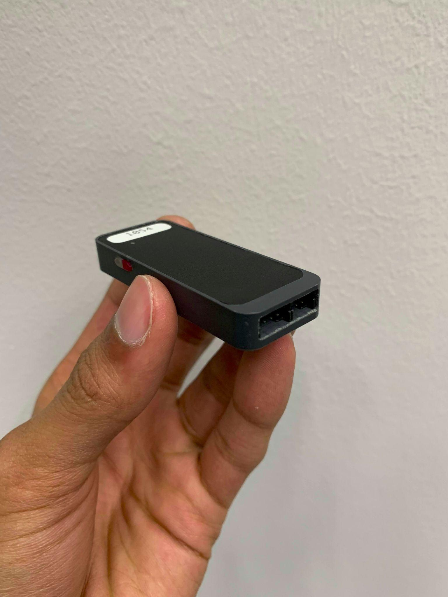
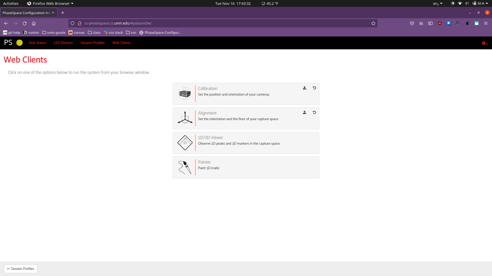
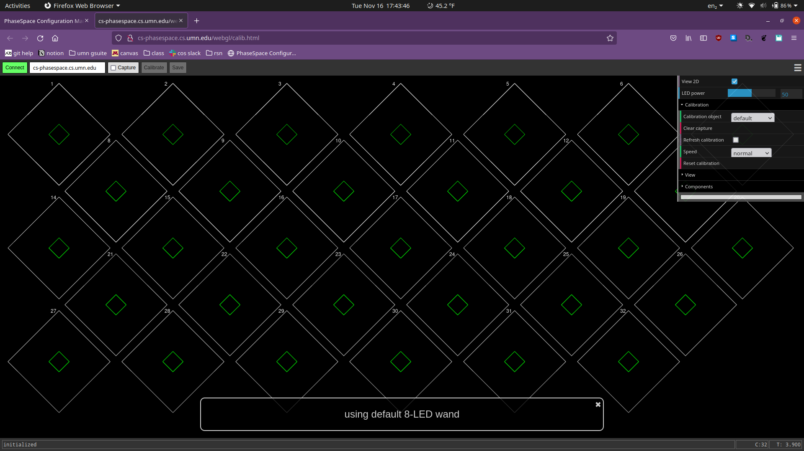

````markdown
# Calibration & alignment

Calibration and alignment are required when cameras move (e.g., net adjustments). Use the calibration wand to collect data for each camera, then run alignment to set the world origin.

## Steps — hardware

1. Locate the calibration wand (usually in a cabinet near the Phasespace system) and the microdriver.
2. Connect the microdriver to the wand — the connector is keyed and fits only one way.
3. Power the microdriver by pressing and holding the white button until the orange LED lights.


*Calibration wand*  

*Microdriver and connector*  

## Calibration (software)

1. Open the Configuration Manager (`Web Clients` → `Calibration`). Click `Connect`.
2. Click the `Capture` checkbox and wave the wand through the volume. Each camera's square should turn green as it sees the wand.
3. Continue until all squares are at least ~50% green. Click `Calibrate` then `Save`.
4. Click `Disconnect` and close the tab.



## Alignment (set world origin)

1. Open the `Alignment` client (from Web Clients) and `Connect`.
2. Place the wand upright at the desired origin point (there may be tape on the floor).
3. Click `Snapshot`. Step +x and take another snapshot; step +z and take another snapshot (Phasespace uses y as up).
4. If satisfied, click `Save` and `Disconnect`. Otherwise, `Reset` and repeat.



---

Notes

- Only perform calibration when you understand the hardware steps. Incorrect calibration can affect measurements for all users.
- If you're unsure, contact the lab contacts listed in the main `README.md` before proceeding.

End of calibration procedure.
````
