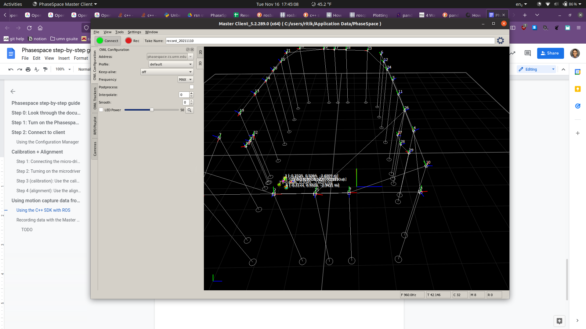
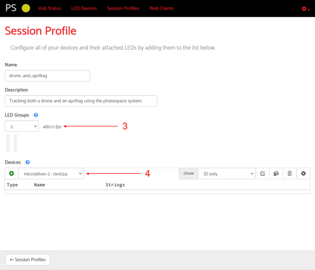

# Phasespace step-by-step guide

## Page 1

Phasespace Guide
Getting Started
Step 0: Look through the documentation
Step 1: Turn on the Phasespace hub
Step 2: Connect to client
Using the Configuration Manager
Calibration + Alignment
Step 1: Connecting the micro-driver into the wand.
Step 2: Turning on the microdriver
Step 3 (calibration): Use the calibration client in the Configuration Manager to calibrate the
system
Step 4 (alignment): Use the alignment client in the Configuration Manager
Using motion capture data from the Phasespace system
Using the C++ SDK with ROS
Recording data with the Master Client
Tracking rigid bodies with the Phasespace system SDK
Step 1: Open the Master Client and connect to the Phasespace system
Step 2: Create a rigid body tracker in the Master Client and export the JSON file
Step 3: Take marker positions from the saved JSON file and put them in your code
Tracking multiple objects with the Phasespace system
Step 1: Ensure Phasespace is aware of your microdrivers
# Phasespace — Step-by-step guide

This document is a cleaned, easy-to-read version of the Phasespace step-by-step guide.
It preserves the original content (instructions, links, credentials, screenshots, and example
code) while improving structure and formatting for quick reference.

Table of contents
- [Getting started](#getting-started)
- [Calibration & alignment](#calibration--alignment)
- [Using motion-capture data](#using-motion-capture-data)
	- [C++ SDK & ROS notes](#c--sdk--ros-notes)
	- [Recording with Master Client](#recording-with-master-client)
- [Tracking rigid bodies (Master Client)](#tracking-rigid-bodies-master-client)
	- [Example JSON for a rigid tracker](#example-json-for-a-rigid-tracker)
	- [C++ usage example (OWL API)](#c-usage-example-owl-api)
- [Tracking multiple objects (Session Profiles)](#tracking-multiple-objects-session-profiles)

---

## Getting started

Key quick steps:

1. Review the official Phasespace documentation.
2. Turn on the Phasespace hub.
3. Connect using either the Configuration Manager (web) or the Master Client (Windows).

Documentation and downloads

- Customer portal (Quick Start, Master Client, C++ API):
	- https://customers.phasespace.com/anonymous/ImpulseX2E/
	- username: `anonymous`  password: `guest`
- SDK: https://customers.phasespace.com/anonymous/SDK/5.2/ (same credentials)
- Master Client downloads: https://customers.phasespace.com/anonymous/Software/ (same credentials)

Turn on the hub

The hub is a short black box (near the Drone Lab entrance). Press the front "on" button to power it up. The front panel LEDs indicate power/network status.

Connect to a client

You can use:

- Configuration Manager (web): `http://cs-phasespace.cs.umn.edu` — user: `admin`, pass: `phasespace`
- Master Client (Windows desktop) — recommended for recording and tracker management.

---

## Calibration & alignment

Calibration and alignment are required when cameras move (e.g., net adjustments). Use the calibration wand to collect data for each camera, then run alignment to set the world origin.

Steps — hardware

1. Locate the calibration wand (usually in a cabinet near the Phasespace system) and the microdriver.
2. Connect the microdriver to the wand — the connector is keyed and fits only one way.
3. Power the microdriver by pressing and holding the white button until the orange LED lights.


*Calibration wand*  

*Microdriver and connector*  

Calibration (software)

1. Open the Configuration Manager (`Web Clients` → `Calibration`). Click `Connect`.
2. Click the `Capture` checkbox and wave the wand through the volume. Each camera's square should turn green as it sees the wand.
3. Continue until all squares are at least ~50% green. Click `Calibrate` then `Save`.
4. Click `Disconnect` and close the tab.


Alignment (set world origin)

1. Open the `Alignment` client (from Web Clients) and `Connect`.
2. Place the wand upright at the desired origin point (there may be tape on the floor).
3. Click `Snapshot`. Step +x and take another snapshot; step +z and take another snapshot (Phasespace uses y as up).
4. If satisfied, click `Save` and `Disconnect`. Otherwise, `Reset` and repeat.


---

## Using motion-capture data

You can consume data in real time via the C++ SDK or record it with the Master Client and post-process offline.

### C++ SDK & ROS notes

- The C++ SDK is distributed as a shared library + headers. Example ROS nodes are available and known to work on Ubuntu 16.04 + ROS Kinetic.
- The SDK requires minimal ROS-specific glue — you can adapt non-ROS example code easily.

### Recording with Master Client

- Master Client is Windows-only, but reports indicate it works under WINE on Linux/macOS.
- Recorded file formats and analysis tools: TODO (you may want to export an example recording and then decide on tooling).

---

## Tracking rigid bodies (Master Client)

Use the Master Client to group markers into rigid bodies and export the tracker definitions as JSON. Then use those definitions in your application to create tracker objects.

Steps

1. Install and open the Master Client. Under `OWL Configuration`, set the address to `cs-phasespace.cs.umn.edu` and click `Connect`.
2. Under `OWL Trackers`, select the markers that make up your rigid body and choose `Create` → `Rigid Body Tracker`.
3. Right-click the newly created tracker and `Save` it to a JSON file.



### Example JSON for a rigid tracker

Below is an example JSON structure exported by the Master Client (trimmed for brevity):

```json
{
	"trackers": [
		{
			"id": 1,
			"markers": [
				{"id": 0, "name": "0", "options": "pos=112.331,-23.6597,111.223"},
				{"id": 1, "name": "1", "options": "pos=128.5,-26.7466,-150.562"},
				{"id": 2, "name": "2", "options": "pos=165.12,-25.5539,162.483"},
				{"id": 3, "name": "3", "options": "pos=170.524,-21.5515,-194.869"},
				{"id": 4, "name": "4", "options": "pos=-173.485,-21.0011,140.923"},
				{"id": 5, "name": "5", "options": "pos=-87.2958,153.926,-8.16226"},
				{"id": 6, "name": "6", "options": "pos=-147.692,-20.2545,102.06"},
				{"id": 7, "name": "7", "options": "pos=-168.002,-15.1584,-163.098"}
			],
			"name": "tracker1",
			"type": "rigid"
		}
	]
}
```

This JSON contains marker positions (pos=x,y,z) that you can copy into code to build trackers programmatically.

### C++ usage example (OWL API)

Example snippet showing how to create a tracker at runtime from the JSON values (pseudo-real code):

```cpp
OWL::Context owl;
if (owl.open(address) <= 0 || owl.initialize("timebase=1,1000000") <= 0) {
	ROS_ERROR("Could not connect to the address %s", address.c_str());
	return 0;
}
ROS_INFO("successfully connected to %s!", address.c_str());
owl.streaming(1);

uint32_t tracker_id = 0;
owl.createTracker(tracker_id, "rigid", "drone_rigid_body");
owl.assignMarker(tracker_id, 0, "0", "pos=112.331,-23.6597,111.223");
owl.assignMarker(tracker_id, 1, "1", "pos=128.5,-26.7466,-150.562");
// ... assign remaining markers ...
```

After creating the tracker, the Phasespace system will stream position (x,y,z) and orientation (quaternion) for the rigid body.

---

## Tracking multiple objects (Session Profiles)

Session profiles define which microdrivers and LED groups are active for a tracking session. Use them to manage multiple tracked objects and avoid marker confusion.

Steps

1. Ensure microdrivers are visible under `LED Devices` (they should be labeled with H/W IDs). If a microdriver is greyed out, power it on and click the eye button.
2. Go to `Session Profiles` and click `+` to create a new profile. Give it a distinct name and description.
3. Configure LED groups (max 8 LEDs per group). Separate nearby LEDs into different groups to reduce marker confusion.
4. Select a microdriver from the dropdown and add it to the profile.
5. Pre-encode the profile (select it in the dropdown and click `+`). You cannot pre-encode more than 6 profiles simultaneously.
6. Enable the profile in the 3D viewer client to switch active LEDs to those specified by the profile.



Notes

- If a marker ID shows `-1` in the UI it will not be used; add more LED groups or rearrange markers to include it.
- To remove a profile from the pre-encoded list, select it and click the trash icon — this only disables pre-encoding, not deletion.

---

If you want, I can:

- Run a quick pass to inline image captions and ensure every image has an alt text and short caption.
- Add a small checklist printable on one page for lab technicians.
- Add OCR instructions if your PDF was scanned (so the original images can be converted to searchable text).

---

End of guide.
