# PhaseSpace Step-by-Step Guide

This document explains how to set up and use the PhaseSpace motion capture system at UMN, with a focus on **ROS integration**. Administrative and SDK details are included in expandable sections.

---

## System Overview

The PhaseSpace system uses **tracking cameras** to detect **active markers (LEDs)** powered by **microdrivers**. These markers can be grouped into rigid bodies (trackers), which the system tracks in real time.

To use the system, you will need:

* **PhaseSpace hub** (located in the Drone Lab).
* **Microdrivers and LED marker sets**

  * Contact Resha Tejpaul ([teipa005@umn.edu](mailto:teipa005@umn.edu)) or Travis Henderson ([hende471@umn.edu](mailto:hende471@umn.edu)) to borrow equipment.
  * To purchase your own:

    * Accessories: [https://phasespace.com/accessories/](https://phasespace.com/accessories/)
    * Sales: [https://phasespace.com/sales/](https://phasespace.com/sales/)
* **Configuration Manager or Master Client software** to set up trackers and export JSON files.

---

## Lab Access

* The PhaseSpace system is located in the **Drone Lab at Shepherd Labs**: [UMN Shepherd Labs](https://cse.umn.edu/mnri/shepherd-lab-tours-0).
* Make sure you have authorized access. If not, email Resha to request lab access or equipment.
* The PhaseSpace hub (short black box) is near the lab entrance. Press the **front power button** to turn it on.

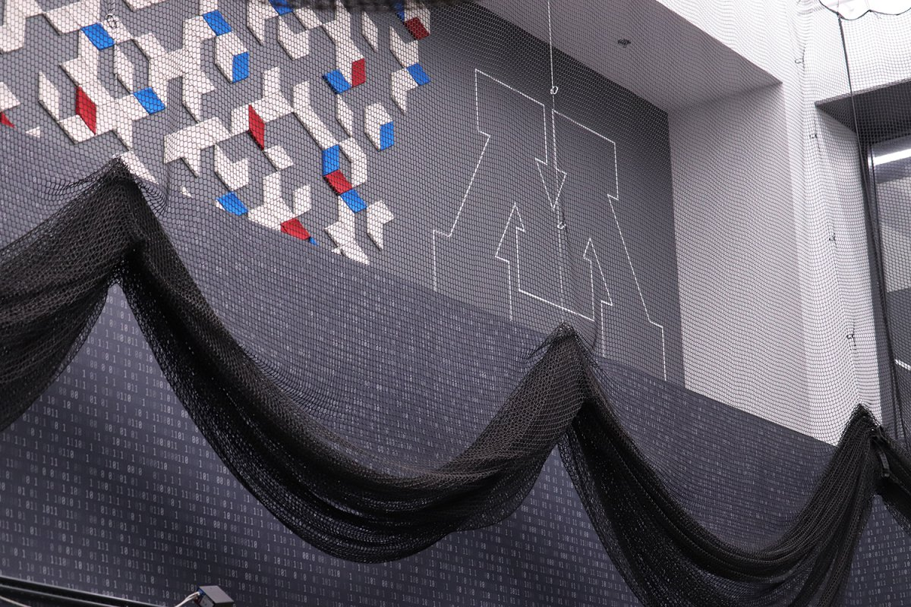
*PhaseSpace system in the Drone Lab*

---

### Floor Plan

If you are working on SLAM, navigation, or need the layout of the lab:

* File path: `images/Floor_Plan/image.png`
* 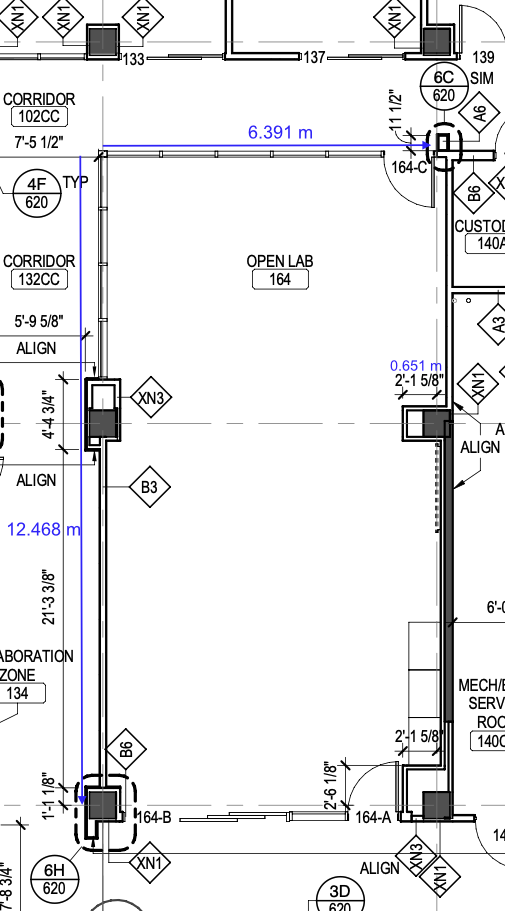

To reserve lab time, contact Resha; you’ll receive a calendar invite once scheduled.

---

## Connecting to the System

1. Power on the PhaseSpace hub.
   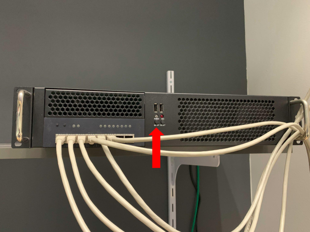
   *Front of the PhaseSpace hub — power button on the left.*

2. Connect to the local network (eduroam recommended).

3. Open the **Configuration Manager** in your browser:

   * URL: [http://cs-phasespace.cs.umn.edu](http://cs-phasespace.cs.umn.edu)
   * Username: `admin`
   * Password: `phasespace`

4. Add and register your **microdriver(s)** under the `LED Devices` tab.

---

## Tracking Multiple Objects (Session Profiles)

**Session Profiles** define which microdrivers and LED groups are active for a tracking session. This avoids marker confusion and supports multiple tracked objects.

Steps:

1. Ensure microdrivers appear under **LED Devices**. If a device is greyed out, power it on and click the “eye” button.
   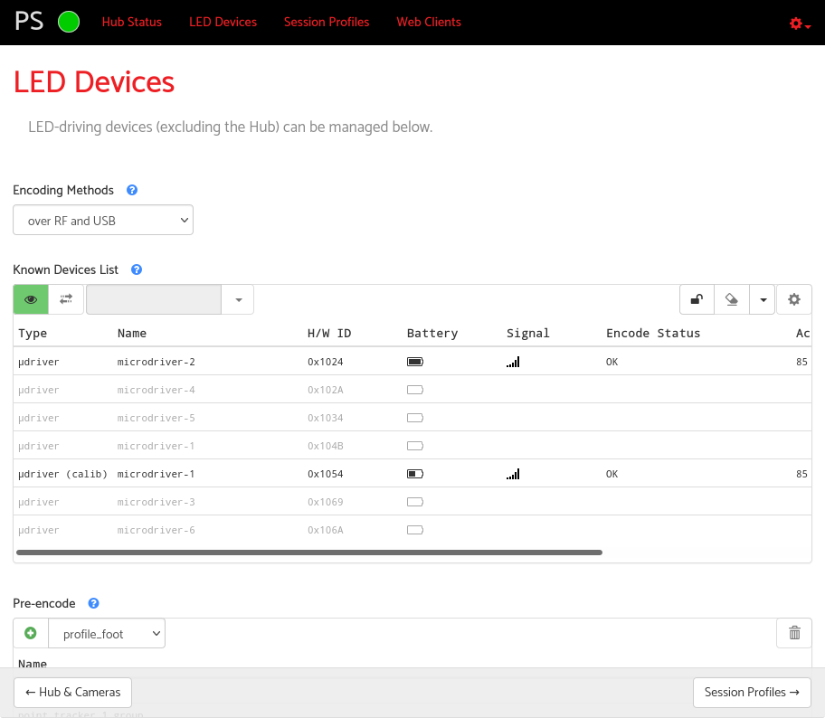

2. Go to `Session Profiles` → click `+` → create a new profile.
   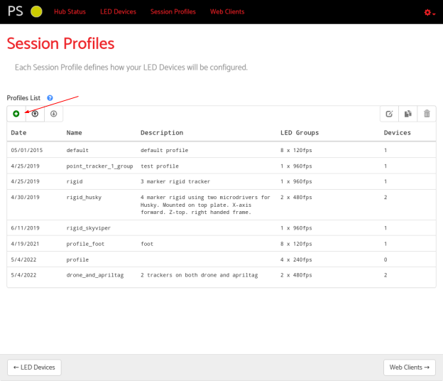
   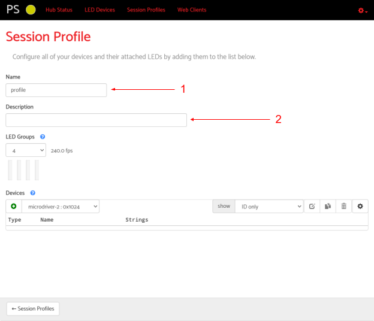

3. Configure **LED groups** (max 8 per group).
   

4. Add a microdriver from the dropdown.

5. Pre-encode the profile (select it → click `+`).
   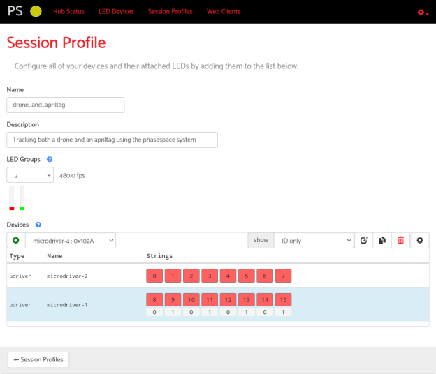
   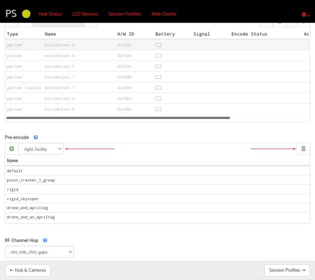

6. Enable the profile in the 3D viewer client.
   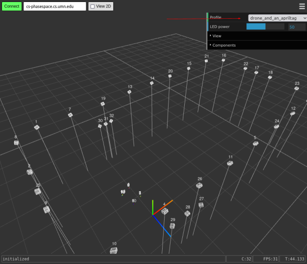

**Notes**

* If a marker shows ID `-1`, it is inactive. Add more LED groups or rearrange LEDs.
* Removing a pre-encoded profile does not delete it — it only disables it temporarily.

---

## Getting JSON Tracker Files (Master Client)

You need JSON files to run ROS nodes.

* The **Master Client** is a Windows app (works under WINE on Linux/macOS).
* Use it to group markers into rigid bodies and export JSON.

**Steps**

1. Install and open **Master Client**.
   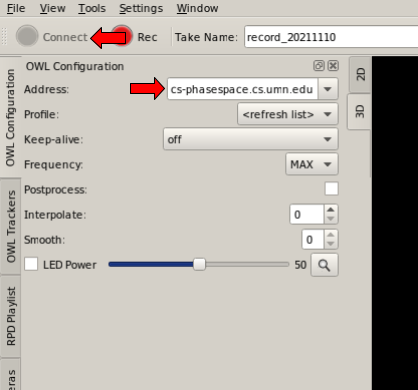

2. Under `OWL Configuration`, set server: `cs-phasespace.cs.umn.edu` → click **Connect**.

3. Under `OWL Trackers`, select markers → `Create → Rigid Body Tracker`.
   
   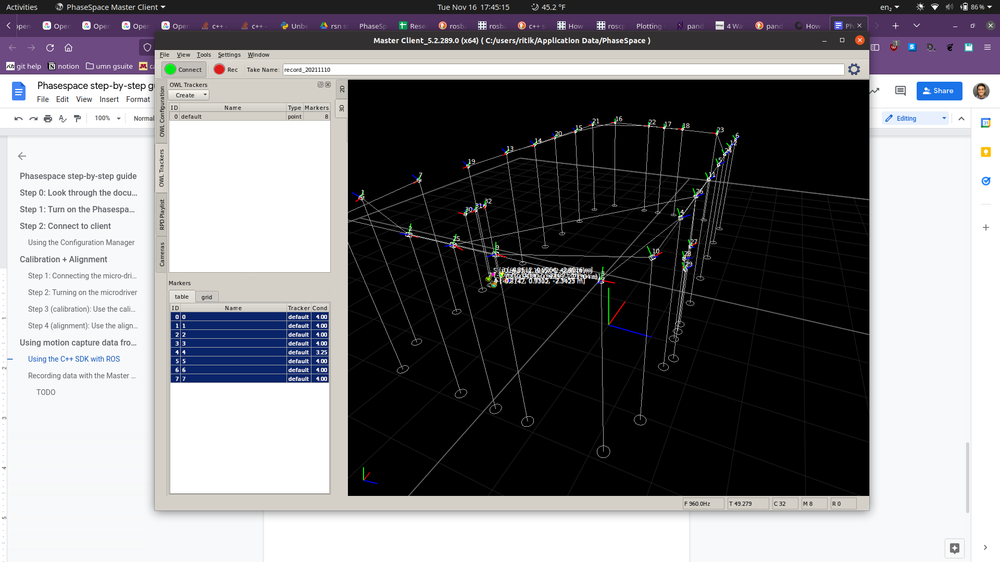

4. Right-click → **Save** as JSON.
   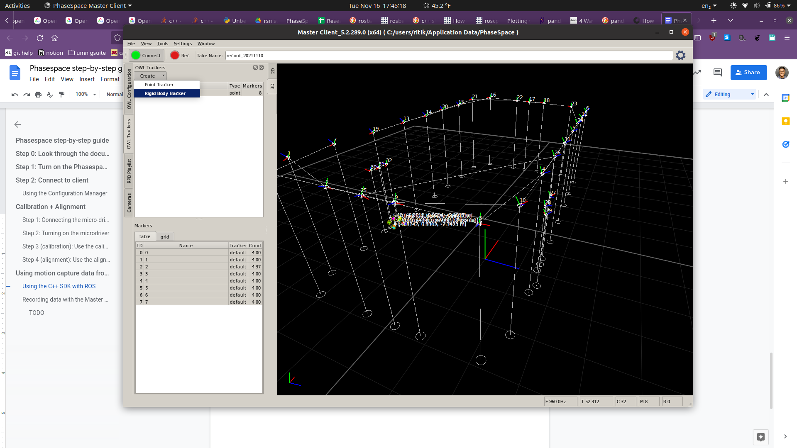
   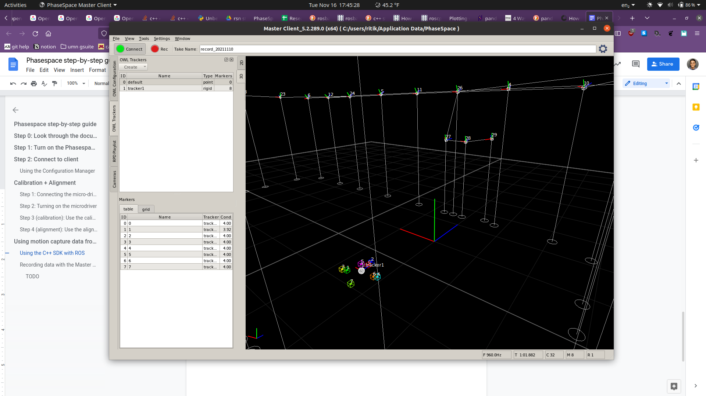
   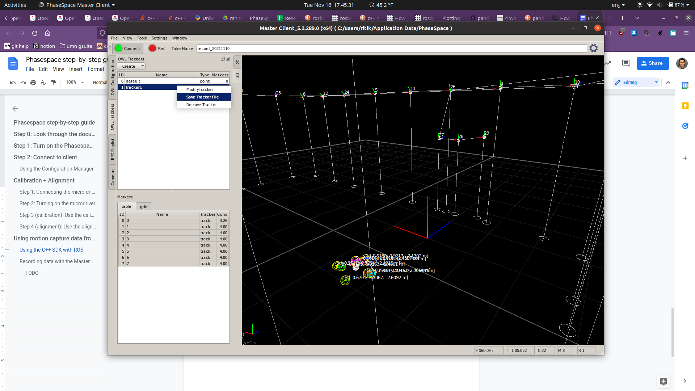

---

## ROS Integration (Noetic & ROS 2)

Two Python ROS nodes are provided:

* `phasespace_node_noetic.py` → ROS Noetic (ROS 1, Ubuntu 20.04)
* `phasespace_node_ros2.py` → ROS 2 (Foxy, Galactic, Humble, etc.)

These nodes:

* Connect to the PhaseSpace server
* Load exported JSONs
* Publish poses into ROS (TF frames and/or topics)

**Example — ROS 2**

```bash
python phasespace_node_ros2.py \
  --device=cs-phasespace.cs.umn.edu \
  --freq=10 \
  --jsonfiles "066E.json" "102A.json"
```

**Flags**

* `--device` → server hostname or IP
* `--freq` → publish rate (Hz)
* `--jsonfiles` → one or more JSON tracker files

---

## Calibration & Alignment

> Only calibrate if and only if you contacted Resha and the other community members who are using the system.

<details>
<summary><strong>Click to expand calibration & alignment steps</strong></summary>

### Hardware Steps

1. Locate the **calibration wand** and a **microdriver**.
   
   
   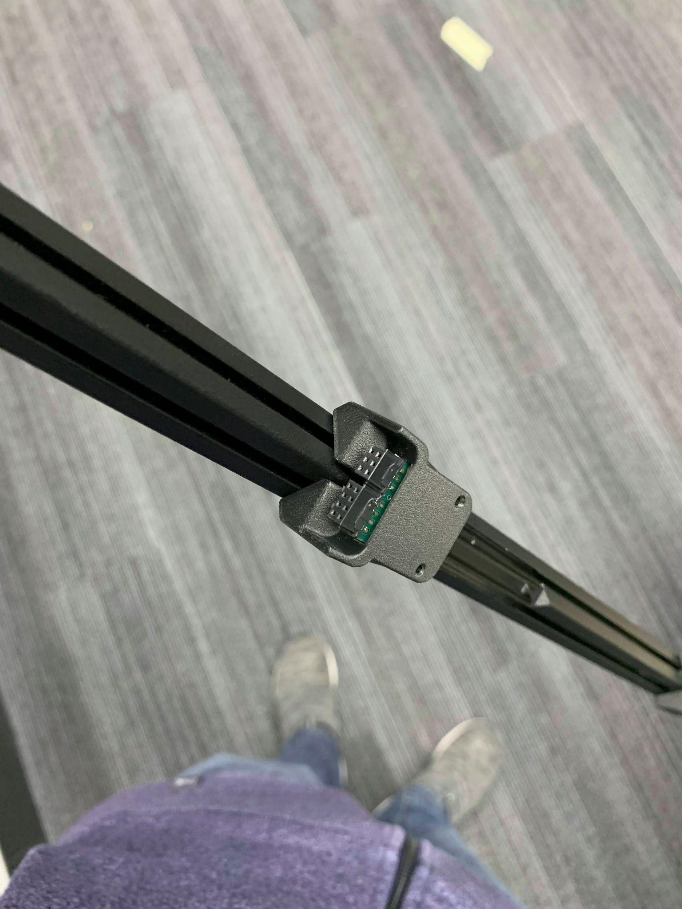

2. Connect the microdriver to the wand (keyed connector).

3. Power on the microdriver (hold the white button until the orange LED lights).

### Calibration (Software)

1. Open **Configuration Manager → Web Clients → Calibration**.
   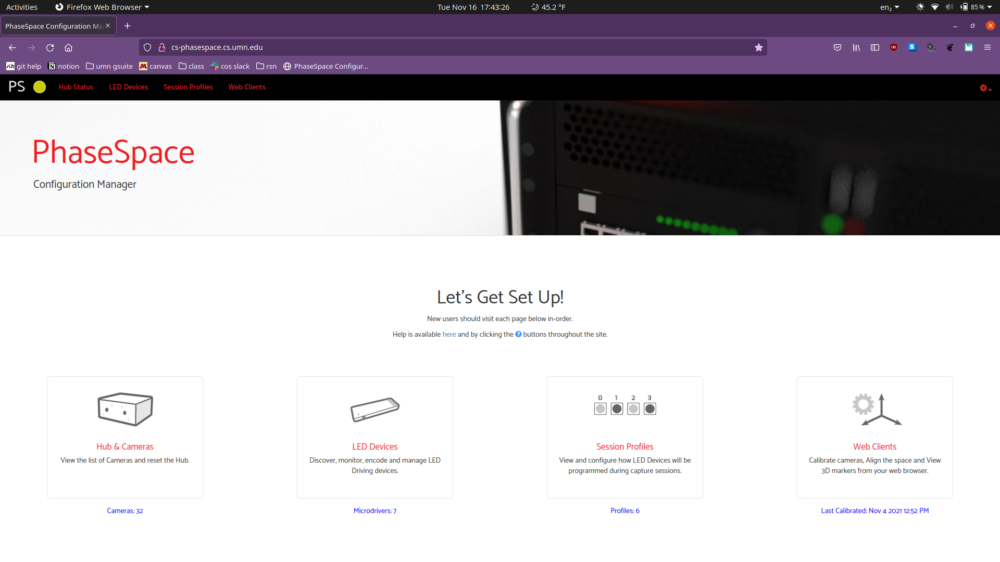
   
   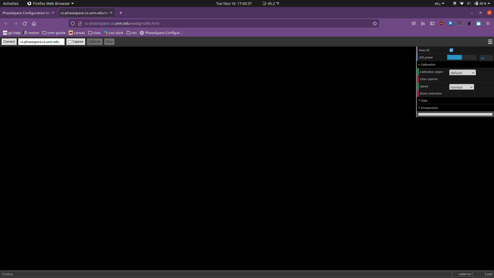

2. Click **Connect**. The wand LEDs should light up.

3. Check **Capture** and wave the wand until all camera squares are ≥50% green.
   

4. Click **Calibrate → Save**. Disconnect.

### Alignment (World Origin)

1. Open the **Alignment** client.

2. Place the wand upright at the floor tape origin.

3. Take snapshots at origin, +x, +z.
   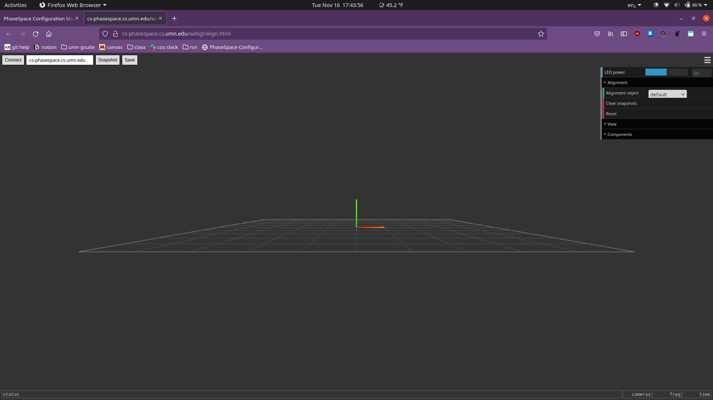

4. Save when satisfied, or reset and repeat.

</details>

---

## Contacts

* **Resha Tejpaul** — [teipa005@umn.edu](mailto:teipa005@umn.edu)
* **Travis Henderson** — [hende471@umn.edu](mailto:hende471@umn.edu)

